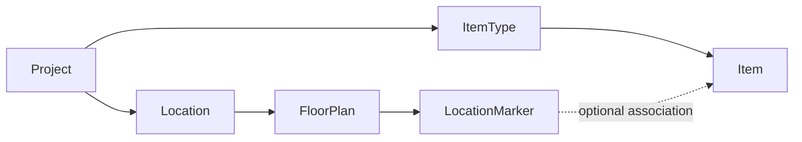
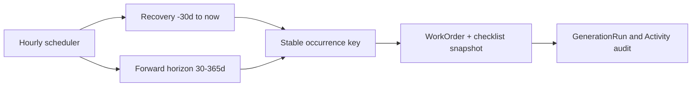

# ADR-009: Project Isolation and Durable Maintenance Generation

## Status

Accepted for phased delivery. Floor-plan isolation is immediate; maintenance persistence is a later additive migration.

## Date

2026-07-20

## Context

Floor-plan services currently authorize the URL project but resolve plans by `floorPlanId` alone. Locations, markers, storage images, and associated items can therefore cross the intended project boundary. Separately, `Event.rrule` expands only for display and cannot represent durable, completable preventive-maintenance occurrences.

The verified baseline is recorded in `docs/progress/MAINTENANCE_DOMAIN_AUDIT_2026-07-20.md`.

## Decision

### 1. Enforce complete ownership chains first

All floor-plan reads and writes prove these chains before storage or mutation:

- The location belongs to the requested project.
- The floor plan belongs to that location/project.
- The marker belongs to the requested floor plan.
- A non-null associated item belongs to the same project.
- One item may be associated only once per floor plan.
- Cross-project plan reads, image reads, lists, uploads, deletes, and marker create/read/update/delete return safe not-found responses without side effects.

### 2. Separate maintenance from calendar events

`Event` remains a calendar entity. Preventive maintenance uses durable plans and work orders with copied execution evidence.

Generation defaults to 90 days forward per project and is configurable from 30 to 365 days. Each project has a required validated IANA `timezone`, initially `Europe/Madrid`. The hourly generator is idempotent. Missing occurrences from the last 30 days are created automatically and appear overdue when applicable. Older gaps require an explicit audited backfill or discard; discard creates durable cancelled occurrence evidence.

### 3. Keep operational history stable

- A MaintenancePlan requires an Item during the MVP.
- WorkOrder stored statuses are only `PENDING`, `IN_PROGRESS`, `COMPLETED`, and `CANCELLED`.
- Overdue is derived from `dueAt`, falling back to `scheduledAt`, plus a nonterminal status; `OVERDUE` is never persisted.
- Each WorkOrder receives a copied checklist snapshot.
- MaintenancePlan is a stable identity; every editable definition is an immutable, effective-dated MaintenancePlanRevision.
- The generator and any explicit backfill select the latest revision effective at the occurrence date, then copy that revision's checklist and definition snapshot into the WorkOrder.
- Plan edits create a new prospective revision and never rewrite an existing revision or WorkOrder.
- COMPLETED orders are immutable.
- IN_PROGRESS orders never change automatically.
- Future PENDING cancellation/regeneration requires explicit confirmation and an audit record for every affected order/run.

### 4. Permission model

| Business role | Current storage | Permissions |
|---|---|---|
| OWNER | `ProjectRole.OWNER` | Administer plans, reprogram, query and execute |
| MANAGER | `ProjectRole.MANAGER` | Administer plans, reprogram, query and execute |
| TECHNICIAN | `ProjectRole.MEMBER` | Query/start/complete permitted orders |
| VIEWER | `ProjectRole.VIEWER` | Read-only |

The business term TECHNICIAN is mapped to the current stored `MEMBER` role for compatibility; role renaming is not part of this phase.

## Future Data Model

The later Prisma change uses this exact logical contract (relation fields and mapped table names follow existing repository conventions):

| Model | Fields |
|---|---|
| `Project` additions | non-null `timezone String @default("Europe/Madrid")`, accepted through shared branded `ianaTimezoneSchema`; `maintenanceGenerationHorizonDays Int @default(90)` |
| `MaintenancePlan` | stable `id`, `projectId`, required `itemId`, `active`, optional `generationCursor`, timestamps; its definition is never updated in place |
| `MaintenancePlanRevision` | immutable `id`, `maintenancePlanId`, `effectiveFrom`, schedule/assignee/title/description/due-offset definition, timestamps; `@@unique([maintenancePlanId, effectiveFrom])`; no overlapping effective ranges |
| `MaintenancePlanChecklistItem` | immutable revision child: `id`, `maintenancePlanRevisionId`, `title`, `position`, `required`, timestamps; `@@unique([maintenancePlanRevisionId, position])` |
| `WorkOrder` | `id`, `projectId`, `maintenancePlanId`, `maintenancePlanRevisionId`, `itemId`, optional `assigneeId`, `occurrenceKey`, definition/checklist snapshot, `scheduledAt`, optional `dueAt`, `status`, timestamps; `@@unique([maintenancePlanId, occurrenceKey])` |
| `WorkOrderChecklistItem` | `id`, `workOrderId`, optional `sourceChecklistItemId`, copied `title`, `position`, `required`, `completed`, optional `completedAt`, `completedById`; `@@unique([workOrderId, position])` |
| `MaintenanceGenerationRun` | `id`, `projectId`, optional `maintenancePlanId`, `trigger` (`HOURLY`, `BACKFILL`, `DISCARD`, `REGENERATION`), optional `actorId`, `windowStart`, `windowEnd`, `status`, created/skipped/cancelled/error counts, optional `details`/`error`, `startedAt`, optional `completedAt` |
| `WorkOrderActivity` | `id`, `workOrderId`, optional `actorId`, `action` (`CREATED`, `STARTED`, `COMPLETED`, `CANCELLED`, `REPROGRAMMED`, `BACKFILLED`, `DISCARDED`), optional `metadata`, `createdAt`; rows are append-only |

`WorkOrderStatus` contains exactly `PENDING`, `IN_PROGRESS`, `COMPLETED`, and `CANCELLED`. `scheduleKind` enforces an XOR: FIXED requires `scheduledAt` and no RRULE; RRULE requires `rrule` and uses `startsAt` as its anchor. IANA validity and the horizon range are service/validation constraints because Prisma/PostgreSQL cannot keep the external IANA registry current automatically.

Project ownership is stored directly on plans, work orders, and generation runs for scoping, while services also prove related Item ownership through `Item.itemType.projectId`.

## Migration Plan

No migration is created by this design work.

1. Add required Project timezone/horizon columns with safe defaults, validate existing rows, and retain `Europe/Madrid` as the initial value.
2. Add maintenance enums and the plan, immutable revision, revision checklist, work-order, work-order checklist, generation-run, and activity tables in one new additive Prisma migration; never edit applied migrations.
3. Add indexes and foreign keys for project, plan, item, schedule/due, status, and activity queries, plus `unique(maintenancePlanId, occurrenceKey)`.
4. Validate on isolated PostgreSQL, regenerate the Prisma client, and deploy persistence disabled.
5. Add generator/services in a later reviewed change; calendar, panel, alerts, and onboarding remain later phases.

## Concrete Test Matrix

| Area | Positive proof | Negative/edge proof |
|---|---|---|
| Plan isolation | own-project read/image/delete | foreign plan/location 404; no storage/write |
| Marker isolation | marker on requested plan | foreign plan, mismatched marker, foreign item 404 |
| Associations | one item marker per plan | duplicate create/reassignment conflict |
| Identity | one order per occurrence | concurrent generator cannot duplicate |
| Time | Europe/Madrid normal scheduling | invalid IANA zone; DST gap and fold |
| Horizon | default 90; accepts 30 and 365 | rejects 29 and 366 |
| Recovery | last-30-day gap becomes overdue-derived | older gap waits for audited backfill/discard |
| Revision/snapshot | recovered or backfilled occurrence selects the revision effective on its occurrence date | later plan edit does not alter existing revision or WorkOrder |
| Lifecycle | permitted start/complete | completed immutable; in-progress unchanged; pending regeneration requires confirmation |
| Roles | owner/manager admin; technician executes | viewer mutation denied |

## Consequences

### Positive

- Project identifiers cannot be combined to cross resource boundaries.
- Maintenance occurrences gain stable identity, execution evidence, auditability, and concurrency safety.
- Derived overdue state cannot drift from timestamps.

### Negative

- Service queries become more explicit and may add joins.
- Snapshot data duplicates checklist text intentionally.
- Hourly generation requires later scheduler operations and DST-aware tests.

## Scope Boundary

This phase implements only floor-plan isolation and negative tests. It does **not** add maintenance models, migration, generator, calendar, operational panel, maintenance alerts, or onboarding.
