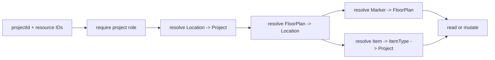

# Design: Floor Plan Isolation and Maintenance Foundation

## Outcome and Boundary

This change applies only the floor-plan isolation refactor and tests now. ADR-009 freezes the later maintenance model. No maintenance schema, migration, generator, calendar, panel, alerts, or onboarding is implemented in this work unit.

## Current Security Slice

`floor-plan-repository.ts` will expose project-scoped queries rather than the current ID-only overload. `floor-plan-service.ts` will centralize ownership-chain guards before StorageDriver or mutations. Marker lookup includes the requested plan; non-null item associations require the same project and no existing `(floorPlanId,itemId)` association.

## Future Maintenance Flow

## Model Contract (Later Migration)

| Model/config | Required design |
|---|---|
| `Project` | non-null `timezone String`, accepted through shared typed `ianaTimezoneSchema`, default `Europe/Madrid`; horizon 30–365, default 90 |
| `MaintenancePlan` | stable project/item identity, active flag, generation cursor; no editable definition fields |
| `MaintenancePlanRevision` | immutable schedule/metadata definition with `effectiveFrom`; generation/recovery/backfill selects the revision effective at the occurrence date |
| `MaintenancePlanChecklistItem` | ordered required/optional immutable revision checklist template |
| `WorkOrder` | project/plan/item, `occurrenceKey`, schedule/due timestamps, snapshot data, four stored statuses; `@@unique([maintenancePlanId, occurrenceKey])` |
| `WorkOrderChecklistItem` | copied label/order/required state and completion evidence |
| `MaintenanceGenerationRun` | window, trigger/actor, result counts, error/details, timestamps |
| `WorkOrderActivity` | immutable actor/action/timestamp/metadata audit |

Business TECHNICIAN maps to current `ProjectRole.MEMBER`; OWNER/MANAGER administer and reprogram, TECHNICIAN reads/starts/completes permitted orders, VIEWER reads only.

## Decisions

| Decision | Rationale |
|---|---|
| Overdue is derived | Avoids status drift; terminal statuses remain explicit |
| Versioned plan revision and per-order snapshot | Plan edits cannot rewrite execution evidence; recovered/backfilled occurrences retain their historical definition |
| Effective-date edits are prospective | Completed is immutable; in-progress and pending are stable |
| Explicit audited pending regeneration | Prevents destructive mass changes |
| Last 30 days auto-recover; older explicit | Balances operational recovery with historical accountability |

## Migration Plan (Not Executed Here)

1. Add non-null project timezone/horizon with safe defaults; validate existing projects.
2. Add maintenance enums/tables, indexes, foreign keys, and the occurrence unique constraint in one new additive migration.
3. Add service-level same-project validation; generate Prisma client; run migration against an isolated database.
4. Deploy models disabled; generator/service wiring follows in a separate reviewed change. Never edit applied migrations.

## Test Matrix

| Boundary | Required proof |
|---|---|
| Plan/image/list/delete | foreign project/location returns not-found; no storage or mutation call |
| Marker read/create/update/delete | foreign plan or mismatched marker returns not-found |
| Item association | foreign item not-found; duplicate same-plan item conflict |
| Generator | hourly idempotency, concurrent unique key, horizon 30/90/365 |
| Time | IANA validation, Europe/Madrid DST gap/fold, local occurrence key |
| Lifecycle | copied checklist; completed immutable; in-progress stable; pending explicit regeneration |
| Recovery/roles | 30-day auto overdue; older audited choice; role matrix |

## Open Questions

None. Product decisions are frozen by ADR-009.
